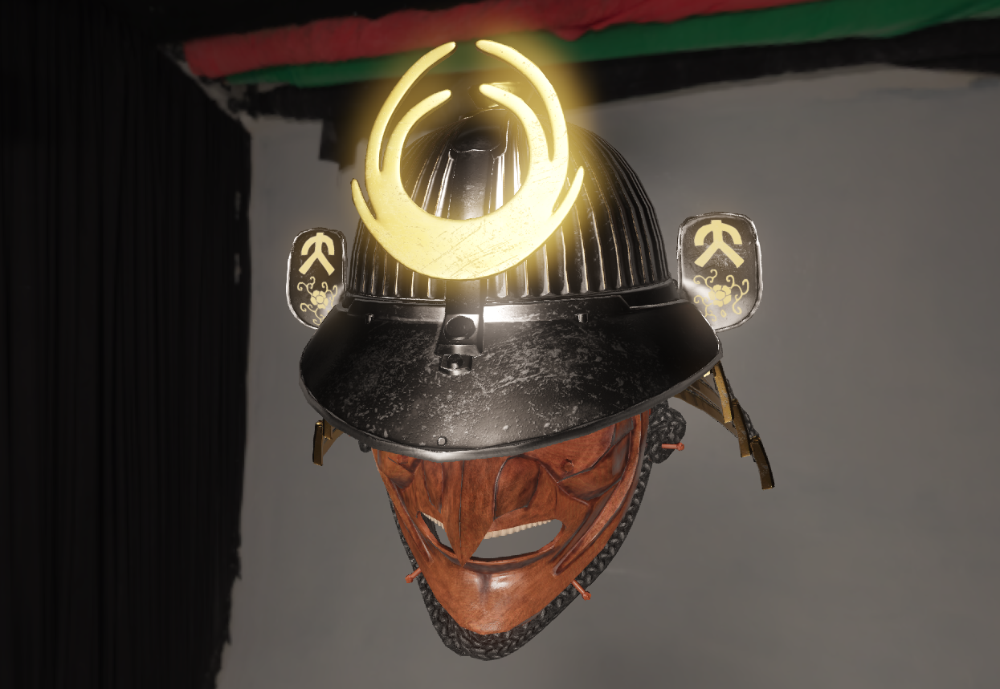

# Gamma
A physically based OpenGL renderer


[Helmet model][etengine] by Robert Lindner

## Features
- Physically based renderer
	- GGX shading model
	- Metallic PBR workflow
- Image-based lighting
- Post processing
	- FXAA
	- Tonemapping: Reinhard, Uncharted 2
	- Hierarchical bloom based on [Jimenez14]
- Variance Shadow Mapping (uni- and omnidirectional)
- ImGUI user interface


## Getting Started
Gamma has a single dependency: [cmake](http://www.cmake.org/download/).
Start by cloning this repository, making sure to pass the `--recursive` flag to grab all the dependencies.
If you forgot, then you can `git submodule update --init` instead.

```bash
git clone --recursive https://github.com/harskish/gamma
cd gamma
cd Build
```

Now generate a project file or makefile for your platform. If you want to use a particular IDE, make sure it is installed; don't forget to set the Start-Up Project in Visual Studio or the Target in Xcode.

```bash
# UNIX Makefile
cmake ..

# Mac OSX
cmake -G "Xcode" ..

# Microsoft Windows
cmake -G "Visual Studio 15" ..
cmake -G "Visual Studio 15 Win64" ..
...
```

[Jimenez14]: http://www.iryoku.com/next-generation-post-processing-in-call-of-duty-advanced-warfare
[etengine]: https://github.com/Illation/ETEngine/tree/master/source/Demo/Resources/Models